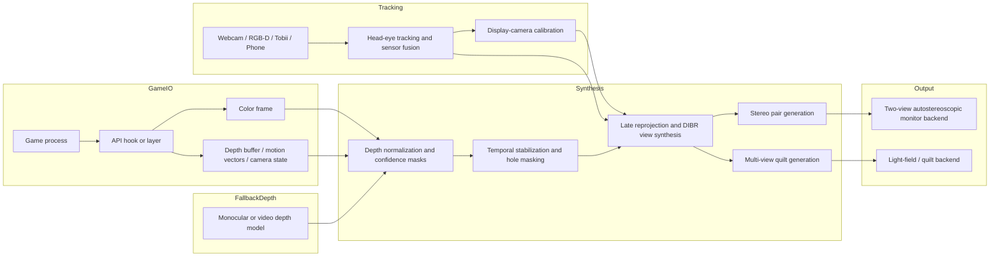

# Building a Glasses-Free 3D Gaming Runtime for World of Warcraft and Other PC Games

## Executive summary

You do **not** want glasses, so the target class of systems is **autostereoscopic**: displays that separate views to each eye with optics in the display itself, or with multi-view/light-field/holographic emission, rather than with shutter or polarized eyewear. In 2026, the market shows that glasses-free gaming is technically viable: Acer SpatialLabs and Samsung Odyssey 3D use eye-tracking plus view mapping on flat panels, while Looking Glass ships multi-view light-field displays and documentable SDK pathways for custom software. But those stacks are still mostly **vendor-bounded** and **profile-driven**, not open, arbitrary-game runtimes that can transparently support titles like *World of Warcraft* and many other PC games. citeturn17search1turn19search1turn19search2turn18search1turn18search2turn28search16turn30search0turn30search13

The practical conclusion is that a working tool is feasible, but only if you treat it as a **systems integration project** rather than a single algorithm. The hard parts are not display optics alone. They are: obtaining **stable scene depth** from arbitrary games; keeping **tracking latency and jitter** low enough that the viewing zones stay locked to the user; synthesizing enough views for the chosen display without blowing the GPU budget; and doing all of that without relying on invasive client modification in titles whose policies make that risky. ReShade, for example, can expose color and depth for many APIs and now has an add-on API, but it explicitly disables depth access during multiplayer to prevent exploitation. Blizzard, meanwhile, states that unauthorized third-party software attached to or modifying the game client is prohibited. citeturn33view1turn32view4turn33view4turn33view5

For that reason, the most realistic roadmap is **two staged**. First, build and validate a **Windows-first prototype** on your own test scene, open engine content, or offline/single-player PC titles using accessible hooks and a head-tracked or light-field display backend. Second, once the stack is stable, evaluate *World of Warcraft* specifically through a policy-aware feasibility gate and favor the least invasive path available. For WoW, an official Lua add-on is **not** enough, because Blizzard’s add-on policy governs UI extensions, not rendering hooks or process-attached injectors. citeturn33view3turn33view4turn33view5

If your goal is the **fastest path to “works on my desk”**, the best starting point is a **single-user, head-tracked lenticular/two-view display** or a vendor monitor with built-in view mapping, because you only need stereo plus good tracking. If your goal is the **best glasses-free effect with less dependence on perfect tracking**, a **multi-view light-field display** is better, but it raises the rendering burden sharply because you now need many views or a convincing multiview synthesis pipeline. True holographic displays remain the furthest from a practical open gaming tool: the research literature still frames them as promising but constrained by hardware and compute. citeturn23search0turn23search4turn23search6turn30search13turn20search10

Because the target hardware, budget, display size, and acceptable policy risk are **unspecified**, this report recommends a **modular architecture** that can start with cheap tracking and a two-view backend, then scale to multiview/light-field output later. The core recommendation is a hybrid runtime built around: **display-mounted outside-in tracking**, **hooked game depth when available**, **temporal depth stabilization**, **depth-image-based reprojection**, and a **display abstraction layer** that can target either a stereo autostereoscopic monitor or a quilt/light-field monitor. That is the shortest route to a working glasses-free tool rather than a research demo. citeturn12search10turn33view1turn34view3turn35search4

## Current status and hard constraints

Commercial products already reveal the contours of the problem. Samsung’s Odyssey 3D explicitly relies on **eye-tracking technology and view-mapping algorithms**, and its Hub software only transfers games that are explicitly supported by the app. Acer’s SpatialLabs stack combines **eye tracking**, **stereoscopic 3D display optics**, **real-time rendering**, “newest shaders and drivers,” and a **TrueGame** system built around **pre-configured 3D profiles**. Looking Glass, by contrast, is less dependent on a single tracked viewpoint because its light-field displays project many perspectives at once, but its pipeline is display-specific and revolves around quilts, RGB-D media, or SDK-mediated rendering. citeturn18search1turn18search2turn18search12turn19search1turn19search2turn28search16turn35search4turn30search13

That ecosystem snapshot leads to a blunt assessment: **there is still no turnkey, open-source, arbitrary-game glasses-free 3D runtime** that combines game hooking, depth extraction, view synthesis, tracking, calibration, and display driving into one maintained stack. There are, however, many strong partial solutions: ReShade for post-process injection and depth access; OpenCV/Open3D/MediaPipe/OpenSeeFace for tracking and calibration; ORB-SLAM3 for pose estimation; MiDaS/Depth Anything/Video Depth Anything for monocular depth; OpenDIBR for depth-image-based rendering; and community projects such as HoloInjector, Depth3D, and Rendepth. The opportunity is therefore integrative, not greenfield. citeturn32view4turn6search0turn6search5turn6search6turn32view1turn5search1turn7search1turn8search17turn14search1turn34view3turn34view0turn34view1turn34view2

The biggest technical gap behind the “**watery depth**” complaint is that frame-by-frame monocular depth is often **relative rather than metric**, vulnerable to thin-structure errors, alpha effects, particles, foliage, volumetrics, HUD contamination, and temporal drift. Depth Anything V2 explicitly improves fine detail and robustness over V1 and diffusion-based baselines, but it is still an image-first depth estimator. Video Depth Anything and DepthCrafter exist precisely because temporal inconsistency is a real problem in video depth estimation; they improve consistency, but they are not yet the obvious answer for a sub-10-millisecond gameplay path. MiDaS, while historically important, is now archived. citeturn8search17turn13search2turn14search1turn14search7turn14search0turn14search2turn7search1

The second major gap is “**weak tracking**.” Two-view autostereoscopic displays depend on accurate knowledge of the viewer’s eyes relative to the panel. Commercial products therefore ship with dedicated tracking and view-mapping pipelines, and the literature on tracked autostereoscopy treats real-time head/eye tracking as central. Webcam-only tracking is cheap and good enough for a prototype, but if you want stable view-zone locking for gameplay, better sensors or display-integrated tracking quickly become attractive. citeturn18search1turn19search1turn22search7turn5search0turn13search13turn11search7

*World of Warcraft* adds a policy constraint that matters as much as the engineering. Blizzard’s anti-cheating agreement defines unauthorized third-party software broadly enough to include software attached to the game process, client modification, or interception/mining of information through Blizzard games, and Blizzard’s 2025 WoW reminder says that third-party software modifying the client is against the Terms of Service. ReShade itself states that depth access is disabled during multiplayer to prevent exploitation. That means a WoW-capable prototype is not just a matter of technical success; it is a matter of **risk tolerance and product strategy**. citeturn33view4turn33view5turn33view1

A concise view of the present state is:

| Area | Current reality | Why it matters |
|---|---|---|
| Displays | Commercial glasses-free monitors exist and work, but mostly with proprietary runtimes, curated profiles, or display-specific SDKs. citeturn19search2turn18search2turn35search4 | You can buy optics today, but not an open universal runtime. |
| Tracking | Reliable tracking is a first-class requirement in vendor products and tracked autostereoscopic systems. citeturn18search1turn19search1turn22search7 | Weak head/eye tracking directly degrades 3D quality. |
| Depth | Hooked game depth is best when accessible; monocular fallback exists but is temporally fragile. citeturn33view1turn13search2turn14search1turn14search2 | “Watery depth” is primarily a depth-source and temporal-stability problem. |
| Integration | Open-source pieces exist for injection, tracking, and reprojection, but not as one maintained stack. citeturn32view4turn32view1turn34view3turn34view0 | Your project should be an orchestrated pipeline, not a single library choice. |
| WoW | Rendering hooks or process-attached tools carry explicit policy risk. citeturn33view3turn33view4turn33view5 | WoW should be a later feasibility gate, not the first milestone. |

## Option space by subsystem

The right architecture depends heavily on the display class. The display determines how many views you must generate, how sensitive the system is to tracking errors, how much crosstalk you must suppress, and whether you can tolerate conventional vergence-accommodation conflict or want a light-field path that may provide better focus cues. Reviews of autostereoscopic technology consistently frame the field around parallax barriers, lenticular systems, multiview/light-field systems, and more ambitious holographic approaches, while also emphasizing persistent trade-offs in spatial resolution, viewing angle, brightness, ghosting/crosstalk, and display complexity. citeturn23search0turn23search6turn23search4turn27search4

| Display technology | What it is | Strengths for a glasses-free gaming tool | Main weaknesses | Best use in this roadmap |
|---|---|---|---|---|
| Lenticular | Microlens layer directs different subpixels to different eye positions; commercial gaming products often combine it with eye tracking and view mapping. citeturn23search3turn18search1turn19search1 | Fastest route to a working single-user gaming prototype; only needs stereo or a small number of synthesized views. citeturn18search1turn19search1 | Narrow sweet spot, crosstalk, reduced effective per-eye resolution, continuous dependence on tracking. Conventional fixed-focus stereo still carries vergence-accommodation conflict. citeturn26search0turn27search1 | **Recommended first display class** if speed to prototype matters most. |
| Parallax barrier | Barrier/slit layer separates views; often simpler but optically less efficient. citeturn23search3turn23search6 | Straightforward concept; can be useful in switchable 2D/3D panels or DIY experimentation. citeturn23search6 | Lower brightness/efficiency and similar sweet-spot/crosstalk problems; less compelling than lenticular for a modern gaming product. citeturn23search6turn27search1 | Possible lab path, but **not** my primary recommendation. |
| Light field | Many simultaneous views over a viewing cone; Looking Glass markets up to 45 views on 16-inch light-field hardware and up to 100 perspectives on larger lines. citeturn20search10turn17search8turn30search13 | Better motion parallax, less dependence on perfect single-view tracking, shareable/group-viewable output, and potentially better accommodation behavior than simple stereo. citeturn27search4turn20search13 | Much higher rendering and bandwidth cost; display-specific quilt pipeline; lower per-view angular/spatial trade-offs still apply. citeturn35search4turn28search16turn27search4 | **Recommended second backend** after the stereo prototype works. |
| Holographic | Wavefront reconstruction or related “holographic” autostereoscopic approaches. citeturn23search4turn23search1 | Best long-term path to more natural depth cues if it becomes practical. citeturn23search4turn23search1 | Still too hardware- and compute-intensive to be the practical basis of an open arbitrary-game runtime today. citeturn23search4turn23search1 | Treat as **future research**, not a shipping prototype target. |

For tracking, a desktop autostereoscopic monitor is fundamentally an **outside-in** problem: you need the eyes relative to the display. Inside-out tracking is useful if the tracked object itself carries cameras and tries to localize in the room, but that is a poorer fit for a monitor on a desk. For a no-glasses desktop system, I therefore recommend a **display-mounted tracker** as the default and treat room-scale SLAM as optional. citeturn12search10turn12search16turn13search0

| Tracking option | Current capability | Pros | Cons | Recommendation |
|---|---|---|---|---|
| Webcam head/face tracking | MediaPipe Face Mesh estimates 468 3D face landmarks from a single camera; MediaPipe Iris adds iris landmarks and reports subject-to-camera distance estimation with relative error under 10%. OpenSeeFace offers CPU face tracking, and AITrack pairs webcam head pose with opentrack. citeturn5search0turn13search13turn32view1turn32view3turn32view2 | Lowest cost, easy to mount to the display, open tooling, good enough for first prototype. citeturn6search2turn32view1turn32view3 | Eye-gaze quality is weaker than dedicated eye trackers; lighting, occlusion, and user distance matter. citeturn13search13turn32view3 | **Default starting point**. |
| Dedicated eye tracker | Tobii Eye Tracker 5 is purpose-built for gaming with 133 Hz sampling and supports both head and eye robustness. citeturn11search7turn11search3 | Stronger for view-zone locking and future foveated rendering experiments. citeturn11search7turn22search1turn22search11 | Proprietary hardware/software, Windows-centric, higher cost. citeturn11search7turn12search1 | **Best upgrade** once the base prototype works. |
| RGB-D / stereo camera on monitor | RealSense D455 offers a stated 0.6–6 m ideal range and depth error under 2% at 4 m; Orbbec Gemini 335 combines active and passive stereo; OAK/DepthAI performs on-device disparity. citeturn11search0turn11search2turn11search1 | Better depth to face/eyes, useful for calibration and robust head-pose tracking under motion. citeturn11search0turn11search10turn11search13 | More setup and calibration, more cost, and often lower effective eye-position precision than dedicated eye tracking. citeturn11search0turn11search2 | Good for **research bench** and sensor fusion. |
| Phone-based tracking | ARKit face tracking on TrueDepth devices provides face position, topology, and eye transforms; AITrack can also use a phone as a camera source. citeturn12search0turn12search12turn32view3 | Surprisingly capable for a custom low-cost networked tracker. citeturn12search0turn12search12 | Extra calibration, latency, thermal, battery, network complexity. citeturn12search12turn32view3 | Acceptable **experimental** option if you already own the phone. |

For scene depth, the ordering is much clearer than for displays. If you can get a game’s real depth buffer or a true stereo render of its geometry, that is overwhelmingly preferable to monocular inference. Neural depth should be treated as a **fallback**, not the core of the stack, unless the source title gives you no other choice. citeturn33view1turn13search2turn14search1turn16search0

| Depth source | Quality for autostereoscopic gaming | Main integration risks | Recommendation |
|---|---|---|---|
| Game depth buffer / motion vectors | Best when accessible, because it is tied to the actual rendered geometry and available at frame time. ReShade exposes color and depth generically across D3D9-12, OpenGL, and Vulkan. citeturn33view1turn32view4 | Reversed/log depth, HUD contamination, transparency issues, API-specific extraction, multiplayer restrictions, and policy risk in protected titles. citeturn33view1turn3search3turn33view4 | **Primary source whenever allowed**. |
| Real stereo render | Gold standard if you control the engine or can truly re-render from two or more virtual cameras. Acer explicitly markets “true stereo 3D” profiles rather than simple image conversion. citeturn19search2turn19search16 | Requires deeper engine access or reliable API interception of camera/projection. citeturn34view0turn10search6 | Best for engines you control or tightly supported titles. |
| Monocular image depth | Depth Anything V2 and MiDaS are practical and widely used foundations. citeturn8search17turn13search2turn7search1 | Relative scale, temporal instability, failure on transparent/particle/UI-heavy regions. citeturn14search7turn14search2 | **Fallback only** for arbitrary content. |
| Temporal video depth | Video Depth Anything and DepthCrafter target temporal consistency for video sequences. citeturn14search1turn14search7turn14search0turn14search2 | Higher latency/compute, still not equivalent to true geometry, and less suited to very low-latency gameplay loops. citeturn14search7turn14search16 | Use for offline validation or streaming mode, not first-gen low-latency play. |
| Physical RGB-D sensors | Excellent for tracking the **user** or real scene, not the game scene. citeturn11search0turn11search2 | They cannot see virtual game geometry. | Not a game-depth source; use for tracking/calibration only. |

On rendering strategy, there is a strong difference between what is **possible** and what is **practical**. A multi-view display makes full N-view rendering expensive. OpenDIBR exists because depth-image-based rendering is one of the few techniques that can plausibly achieve real-time multi-view rendering from color-plus-depth. Looking Glass’s Bridge pipeline also makes clear that you can hand off quilts or RGB-D-like content to a display-specific runtime rather than fully controlling optical calibration yourself. citeturn34view3turn16search8turn35search4turn28search16

My recommendation is therefore a **hybrid render path**:

- For a two-view display, use **true stereo** if possible, or one color frame plus stabilized depth plus **late reprojection** for modest interocular synthesis.
- For a multiview display, do **not** start by brute-force rendering 45–100 views. Start with one or two anchor views, synthesize intermediate views with DIBR, and reserve full multiview rendering for later milestones or for engines you directly control. citeturn34view3turn20search10turn17search8turn30search13

For performance, the most useful generic optimizations are **late-latched reprojection**, **variable rate shading**, and possibly **open upscaling/performance SDKs** to buy headroom. Direct3D 12 VRS is explicitly designed to reduce shading cost where perceptual sensitivity is lower, and AMD’s open FidelityFX SDK exists to improve performance in D3D12/Vulkan applications. But these are **headroom tools**, not substitutes for correct geometry and depth. citeturn15search0turn15search8turn15search1turn15search9

The user-experience constraints should be treated as first-order requirements, not polish. Visual comfort research around stereo displays identifies vergence-accommodation conflict as a major contributor to discomfort and defines a “zone of comfort,” while the autostereoscopic literature and measurement work keep returning to crosstalk, viewing-angle limits, and image-quality trade-offs. Light-field displays are attractive precisely because they can better reproduce focus-related cues than fixed-focus stereo, but they also introduce their own angular and resolution trade-offs. citeturn26search0turn26search7turn27search1turn27search7turn27search4

## Candidate projects and libraries

The tables below prioritize components that already implement important pieces of the pipeline. “Maturity” and “integration effort” are my assessments based on release recency, documentation, and scope. Where the license was not surfaced clearly in the retrieved official source, it is marked **unspecified**.

| Candidate | What it already implements | License | Maturity | Integration effort | Pros | Cons | Recommended role in prototype | Official link |
|---|---|---:|---|---|---|---|---|---|
| MediaPipe Face Mesh / Iris | Real-time face landmarks and iris landmarks from a single RGB camera; Iris estimates camera distance with reported relative error under 10%. | Apache-2.0 | High | Low | Cheap, cross-platform, good default webcam tracker. | Not a full eye-gaze tracker; needs your own calibration/filtering. | **Default low-cost outside-in tracker**. | citeturn5search0turn13search13turn6search2 |
| OpenSeeFace | CPU real-time face and facial-landmark tracking with Unity integration. Official repo states BSD-2-Clause and shows continued repo activity, though latest packaged release is old. | BSD-2-Clause | Medium | Low | Open, lightweight, good for local head/face pose. | Release cadence is less current than repo updates; gaze quality is limited. | **Alternative webcam tracker**, especially for Windows desktop apps. | citeturn32view1turn31search4 |
| AITrack | Webcam-based 6DoF head tracker designed to feed opentrack. | MIT | Medium | Low | Good under poor light; works with partial occlusion; supports phones as cameras. | Separate app and network/protocol setup add operational complexity. | **Quick-start head-pose path** if you want off-the-shelf desktop tracking. | citeturn32view3 |
| opentrack | Head-tracking relay with filters, multiple protocols, neural-net tracker option, UDP, Tobii support, and RealSense input support. | Unspecified in retrieved official source | High | Medium | Mature routing/filtering glue for many head-tracking devices. | Built around simulator/game input paths; not a display-calibrated autostereo stack by itself. | **Tracking hub and filter layer**, not the whole solution. | citeturn32view2turn25search8 |
| OpenCV | Camera calibration, stereo calibration/rectification, ArUco tracking, stereo depth. | Apache-2.0 | High | Low | Essential primitives for calibration, pose estimation, stereo geometry. | You must assemble the pipeline yourself. | **Foundational calibration/computer-vision toolbox**. | citeturn6search0turn6search4turn6search15turn12search3 |
| Open3D | RGB-D odometry and broader 3D data processing library. | MIT | High | Medium | Useful for RGB-D fusion, testing, and geometric debugging. | More useful for research benches than latency-critical shipping loops. | **Calibration, point-cloud, and RGB-D evaluation toolbox**. | citeturn6search1turn6search5turn5search3 |
| ORB-SLAM3 | Real-time visual / visual-inertial / RGB-D / stereo SLAM with strong published results. | Unspecified in retrieved official source | High | High | Excellent if you need robust room-scale pose or camera rig localization. | Overkill for a display-mounted desktop tracker; more integration and tuning. | **Optional sensor-fusion/inside-out module**, not the default. | citeturn5search1turn13search0 |

| Candidate | What it already implements | License | Maturity | Integration effort | Pros | Cons | Recommended role in prototype | Official link |
|---|---|---:|---|---|---|---|---|---|
| Depth Anything V2 | Modern monocular depth with stronger fine detail and robustness than V1 and SD-based models. | Apache-2.0 | High | Medium | Current, strong baseline, multiple model scales. | Still image-first relative depth; needs stabilization for gameplay. | **Primary monocular fallback** when game depth is unavailable. | citeturn8search17turn8search1turn13search2 |
| MiDaS | Robust monocular depth estimation foundation model family. | MIT | Medium | Low | Very well-known baseline and easy to integrate. | Official repo is archived, so it is no longer the forward-looking choice. | **Baseline for comparison**, not my first choice for a new tool. | citeturn7search1turn7search5 |
| Video Depth Anything | Temporally consistent long-video depth estimation, with the paper claiming a smallest model capable of real-time 30 FPS. | Apache-2.0 | Medium | High | Addresses the exact temporal flicker problem behind watery depth. | Still a video-depth model, not a hooked-geometry substitute; heavier than image depth. | **Offline/streaming stabilization candidate** and research path for future live mode. | citeturn14search1turn14search7 |
| DepthCrafter | Diffusion-based temporally consistent long depth sequences without needing camera poses or optical flow. | Unspecified in retrieved official source | Medium | High | Strong temporal consistency and fine detail in research mode. | Heavier and less obviously suited to low-latency gaming loops. | **Research baseline** for how much temporal improvement is possible. | citeturn14search0turn14search2 |
| OpenDIBR | Real-time depth-image-based renderer for multi-view/light-field-style output using CUDA/OpenGL. | MIT | Medium | High | Closest open reference for real-time DIBR/use of color+depth to move viewpoint. | NVIDIA/CUDA assumptions; not a generic drop-in game plugin. | **Best open reference for multiview reprojection architecture**. | citeturn34view3turn16search8 |
| HoloInjector | OpenGL API interception to convert generic single-view applications toward multiview/autostereoscopic output. | MIT | Low | High | Directly relevant conceptually to arbitrary-app multiview conversion. | Prototype/thesis-level maturity and OpenGL-specific. | **Architectural reference**, not a production dependency. | citeturn34view0turn29search3turn10search6 |
| 3D Photo Inpainting | Layered depth image and inpainting for novel-view synthesis with motion parallax. | Mixed; retrieved license page surfaces Attribution-NonCommercial components | Medium | High | Useful occlusion/hole-filling ideas for DIBR. | Not suited to low-latency gameplay and licensing is awkward for commercial paths. | **Research inspiration only** for occlusion completion. | citeturn36search0turn29search5 |

| Candidate | What it already implements | License | Maturity | Integration effort | Pros | Cons | Recommended role in prototype | Official link |
|---|---|---:|---|---|---|---|---|---|
| ReShade | Cross-API post-process injector for D3D9-12/OpenGL/Vulkan with depth/color access and add-on API. | BSD-3-Clause | High | Medium | Very relevant for arbitrary game experimentation on Windows. | Depth is disabled during multiplayer; full add-on build is unsigned; policy risk for protected titles. | **Primary prototyping hook** for offline/friendly titles. | citeturn33view1turn32view4 |
| Rendepth ReShade | MIT-licensed 2D-to-3D ReShade plugin with SBS/anaglyph/stereo output. | MIT | Medium | Low | Current community proof that a ReShade-based stereo conversion path can be made usable. | Still screen-space conversion, not true multiview autostereo. | **Great community benchmark** for your depth-to-stereo quality bar. | citeturn34view2 |
| Depth3D / SuperDepth3D | Large community shader project for ReShade, including depth-map-based 3D. | Unspecified in retrieved official source | High | Low | Huge body of compatibility knowledge and tuning practice. | Community project; not purpose-built for autostereo multiview. | **Reference corpus** for practical depth-artifact handling. | citeturn34view1 |
| DXVK | D3D8/9/10/11-to-Vulkan translation layer. | Unspecified in retrieved official source | High | Medium | Valuable if you later want a Vulkan-layer backend on Linux/Proton. | Not the easiest Windows-first path for WoW-oriented work. | **Secondary portability path**, not the first milestone. | citeturn24search5turn24search14 |
| vkd3d-proton | D3D12-on-Vulkan implementation for Proton with aggressive focus on game performance/compatibility. | LGPL-2.1 | High | High | Useful if you build a Vulkan-centric Linux path or diagnostics stack. | Driver requirements are strict; not the easiest initial route. | **Advanced portability and diagnostics path**. | citeturn34view5 |
| Looking Glass Bridge SDK / samples | Display-specific SDK path for quilts/RGBD/scenes to Looking Glass displays; supports D3D/OpenGL/Metal/Vulkan, with OpenGL noted as the most robustly supported. | Bridge SDK is proprietary/custom licensed; some plugins are MIT | Medium | Medium | Strongest documented path into a production multiview display. | Not fully open; display-specific; some repos are alpha or custom-licensed. | **Best multiview display backend** once your synthesis works. | citeturn35search4turn35search1turn28search16turn34view4turn35search2 |
| Looking Glass Unreal Plugin | Open-source Unreal plugin for Looking Glass, but currently focused on high-quality holographic stills/videos rather than real-time content generation. | MIT | Medium | Medium | Useful source for device integration patterns. | Not intended for realtime generation today. | **Reference integration code**, not your runtime engine. | citeturn28search0turn28search9 |

A few additional tools deserve mention even though I am not elevating them to core dependencies in the first prototype. **RenderDoc** is invaluable as a graphics debugger and frame analyzer for D3D11/12, OpenGL, and Vulkan, so it belongs in your reverse-engineering and depth-surface-discovery workflow. **VulkanTools** and monitor layers are useful for instrumentation. **AMD FidelityFX SDK** and D3D12 **Variable Rate Shading** belong in the performance phase, not the correctness phase. citeturn2search0turn24search4turn24search13turn15search0turn15search1

## Proposed architecture and implementation roadmap

The architecture below is designed around one principle: **separate game integration from display integration**. That lets you test the difficult parts independently. The game-facing side extracts color, depth, motion, and camera data from the source title. The display-facing side turns those signals into either stereo output for a head-tracked autostereoscopic monitor or a multi-view quilt for a light-field display. In the middle sits the quality-critical layer: temporal depth stabilization, occlusion masks, view synthesis, and late reprojection. That is where watery depth and weak tracking are either solved or exposed. The shape of this design is supported by the tools above: ReShade-like hook capability, DIBR-style rendering, and display SDKs such as Looking Glass Bridge. citeturn32view4turn34view3turn35search4

The implementation roadmap should be prioritized by **risk retirement**, not by feature temptation.

| Milestone | What you build | Effort | Exit criteria | Why it is first or later |
|---|---|---|---|---|
| Calibration bench | Display-mounted tracker, camera calibration, display-space head/eye coordinates, and a synthetic test scene. Use OpenCV plus MediaPipe/OpenSeeFace at first. citeturn6search15turn5search0turn32view1 | Low | Stable head pose with repeatable display-relative coordinates; no drift over a normal seated play session. | You cannot debug view synthesis if the eyes are unstable. |
| Stereo autostereo proof | Two-view backend on a glasses-free monitor or a stereo-compatible pathway, using your own rendering test scene first. | Medium | Correct left/right view separation, comfortable depth on static and moving scenes, acceptable crosstalk at nominal seating distance. citeturn27search1turn26search0 | Fastest way to prove the fundamentals. |
| Hooked depth prototype on friendly title | ReShade-based or equivalent prototype on a non-protected or offline game; capture color + depth + camera assumptions. | Medium | Extracted depth is geometrically stable, not UI-polluted, and survives camera motion. citeturn33view1turn32view4 | This reveals the real feasibility of arbitrary-game support. |
| Temporal stabilization pass | Depth confidence masks, temporal smoothing, disocclusion management, and reprojection for minor head motion. | Medium | “Watery” shimmer drops visibly in motion; depth edges stop breathing on static geometry. citeturn14search1turn14search7turn34view3 | This is the quality breakpoint between demo and usable tool. |
| Multiview/light-field backend | Quilt synthesis and Looking Glass-style output or equivalent multiview pipeline. | High | Stable multiview display output with plausible motion parallax across the display’s viewing cone. citeturn35search4turn20search13turn30search13 | More ambitious, because view count multiplies cost. |
| Performance hardening | VRS/open upscaling/headroom work, GPU-CPU pipelining, tracking fusion optimization. | High | Native-refresh operation on target display in representative game scenes. citeturn15search0turn15search1 | Performance only matters after correctness is demonstrated. |
| WoW feasibility gate | Policy review and only the least invasive technical path you are prepared to accept. | Medium | Explicit go/no-go decision based on policy risk, not just code readiness. citeturn33view3turn33view4turn33view5 | WoW should be a gated milestone, not the test harness for early R&D. |

The most important engineering decision is **what to do about depth**. My recommendation is:

- **Primary path:** consume a real game depth buffer or true stereo/headless re-render path whenever available.
- **Fallback path:** use Depth Anything V2 for single-image fallback, then add a temporal stabilizer or Video Depth Anything-inspired streaming mode later.
- **Do not** anchor the first prototype on diffusion-heavy temporal depth; that is better as a quality benchmark than a latency budget you must hit in milestone one. citeturn33view1turn8search17turn14search1turn14search0

The second key decision is **tracking strategy**. My recommendation is:

- Start with **outside-in display-mounted tracking** using a good webcam and MediaPipe/OpenSeeFace.
- Add **Kalman or One-Euro-style smoothing** and late-latched reprojection in your runtime.
- Upgrade to **Tobii** or a display-integrated tracker only after proving that tracking is your dominant error source rather than depth instability. That keeps the bill of materials under control. The literature on foveated rendering and gaze-contingent methods reinforces that eye-tracked performance strategies only work well when accuracy and latency are good. citeturn5search0turn32view1turn11search7turn22search1turn22search11turn22search15

The third key decision is **whether to optimize for stereo or multiview first**. Here the answer is not ambiguous: optimize for **stereo autostereo first**. A two-view prototype lets you solve tracking, calibration, depth stability, comfort range, and hook quality without immediately multiplying the rendering burden. Multiview/light-field support should become the second backend once those fundamentals are stable. Looking Glass’s own Bridge documentation makes clear that quilts and RGB-D media are valid integration forms, which is exactly the kind of abstraction a second-phase backend wants. citeturn35search4turn28search16

A practical set of initial performance targets, framed as engineering recommendations rather than claims of hard physiological thresholds, is:

| Metric | First workable target | Better target | Why |
|---|---|---|---|
| End-to-end frame delivery | Match the display’s native refresh where possible; e.g., 60 Hz on many light-field displays and 165 Hz on Samsung Odyssey 3D. citeturn20search10turn18search0 | Sustain native refresh in typical scenes, not just empty benches. | Below-refresh operation exposes latency and judder immediately in head-coupled viewing. |
| Tracking-to-display latency | Under ~20 ms | Under ~10–12 ms | Head-coupled rendering, gaze-contingent rendering, and late reprojection all improve as latency falls. citeturn22search1turn15search11turn15search3 |
| Tracking jitter | Sub-degree angular jitter; sub-centimeter positional jitter at the display | Lower if you can achieve it | Jitter translates directly into unstable view-zone assignment on two-view displays. citeturn22search7turn18search1 |
| Depth stability | No visible “breathing” on static geometry; temporal depth gradients remain smooth | Equivalent stability from fast camera pans and spell effects | This is the practical interpretation of eliminating watery depth. citeturn14search1turn14search7 |
| Crosstalk | Below the point where ghost images are obvious in depth-ordering tasks | As low as the display optics allow | Crosstalk is a central autostereo image-quality metric. citeturn27search1turn27search7 |

## Evaluation methodology and hardware recommendations

A convincing runtime needs both **objective** and **subjective** evaluation. Objective testing tells you whether the pipeline is geometrically stable; subjective testing tells you whether people actually prefer it, feel depth from it, and can watch it without fatigue. Comfort research on stereo displays shows that vergence-accommodation conflict and disparity changes matter, while autostereoscopic work emphasizes crosstalk and view-zone quality. Those should become explicit test variables, not afterthoughts. citeturn26search0turn26search7turn27search1turn27search7

My recommended evaluation stack is:

| Evaluation area | Measurement | Suggested method |
|---|---|---|
| Depth quality | Edge fidelity, disocclusion holes, temporal stability, depth ordering accuracy | Use controlled synthetic scenes with known geometry first, then representative game captures. Compare game-depth mode vs monocular fallback vs temporally stabilized mode. Cite failures with spell effects, particles, foliage, HUD, transparencies. citeturn13search2turn14search1turn14search7 |
| Tracking quality | Pose error, jitter, loss rate, reacquisition time | Record head motion against a fiducial or calibration board using OpenCV and compare raw vs filtered tracker output. citeturn12search3turn6search15 |
| Display quality | Crosstalk, viewing-zone width, useful seating range | Follow the spirit of recent crosstalk and far-field characterization work: measure across workspace positions, IPD assumptions, and point-of-rendering shifts, not just one perfect seat. citeturn27search1turn27search0 |
| Performance | FPS, frame time percentiles, CPU/GPU stage times, dropped/reprojected frames | Measure full pipeline stages separately: capture, depth, stabilization, synthesis, display handoff. Use RenderDoc/Vulkan tooling where relevant. citeturn2search0turn24search4 |
| Comfort | Eye strain, headaches, disorientation, subjective preference | Use a short visual-comfort Likert battery after each condition and a sickness questionnaire such as SSQ or VRSQ when sessions are longer. The stereo comfort literature is the right conceptual basis. citeturn26search0turn26search6turn26search10 |

For a user study, I would run a **within-subject design** with small pilot and then a main study. The factors I would vary are:

- **Display backend:** two-view tracked autostereo vs multiview/light-field.
- **Depth source:** real/hooked depth vs monocular fallback vs temporally stabilized fallback.
- **Tracking mode:** webcam-only vs dedicated eye tracker or RGB-D fusion.
- **Depth strength range:** conservative vs aggressive disparity settings, kept within a comfort-aware envelope informed by the stereo comfort literature. citeturn26search0turn26search7

The task set should include both **perceptual** and **functional** tasks: depth ordering, target placement, reading/UI legibility, following a moving target while seated, and a short gameplay segment. The key scores should be perceived depth realism, comfort, preference, and task error rate. Autostereoscopic depth-perception studies support the idea that subjective and task-based measurements should be combined rather than relying on one alone. citeturn26search1turn27search7

Because budget is unspecified, the hardware options below are grouped by what problem they solve rather than by price alone.

| Hardware option | What you get | Trade-offs | Best role | Source |
|---|---|---|---|---|
| **Webcam + MediaPipe/OpenSeeFace** | Cheapest display-mounted tracking stack. | Lower eye-tracking quality; more sensitive to lighting. | **Start here** for the first prototype. | citeturn5search0turn13search13turn32view1 |
| **Tobii Eye Tracker 5** | Gaming-focused 133 Hz head/eye tracking. | Proprietary; added cost. | Upgrade when tracking weakness is clearly your bottleneck. | citeturn11search7turn11search3 |
| **Intel RealSense D455** | Stereo depth camera with stated 0.6–6 m ideal range and <2% depth error at 4 m. | Extra sensor and calibration complexity. | RGB-D tracking bench and fusion experiments. | citeturn11search0turn11search4 |
| **Orbbec Gemini 335** | Newer stereo depth + RGB with open SDK v2 support and indoor/outdoor positioning. | Fewer community gaming examples than webcam/Tobii. | Good research alternative to RealSense. | citeturn11search2turn11search10 |
| **Luxonis OAK-D / DepthAI** | On-device stereo disparity and spatial AI camera ecosystem. | More robotics-oriented workflow. | Good if you want sensor-side compute and custom pipelines. | citeturn11search1turn11search13 |
| **iPhone with TrueDepth and custom ARKit app** | High-quality face tracking and eye transforms from a phone you may already own. | Network, battery, thermal, app-development overhead. | Viable experimental tracker if you want stronger face/eye geometry without buying a dedicated tracker first. | citeturn12search0turn12search12 |
| **Samsung Odyssey 3D 27** | 4K 165 Hz glasses-free display using eye tracking and view mapping; requires Odyssey 3D Hub and USB plus display connection; Hub only supports specified games. | Closed ecosystem; curated game support. | Fastest path to single-user “looks like a product” if you accept vendor constraints. | citeturn18search0turn18search1turn18search2turn18search4 |
| **Acer SpatialLabs View Pro 27** | 27-inch 4K SpatialLabs display with eye tracking and developer/game tooling; TrueGame uses pre-configured profiles. | Closed/profile-based runtime. | Good benchmark for what a polished stereo-autostereo pipeline looks like. | citeturn17search1turn19search1turn19search2 |
| **Looking Glass 16 / 27 / 32** | Light-field displays with 4K OLED / 5K / 8K panels, multi-view output, and documented Bridge SDK paths; viewing cones are around 53–60° depending on model. | Higher render cost; display-specific SDK and licensing. | Best research and advanced-backend target for **true** glasses-free multiview. | citeturn20search10turn30search13turn20search13turn35search4 |
| **Phone pair or webcam pair as stereo rig** | OpenCV stereo calibration and low-cost custom depth/tracking experiments. | Synchronization and calibration overhead; usually awkward for daily play. | Lab-only, not my recommendation for the first user-facing build. | citeturn6search15turn5search2turn12search12 |

My bottom-line hardware recommendation is therefore:

- **Fastest working prototype:** webcam + MediaPipe/OpenSeeFace + a single-user autostereoscopic monitor backend.
- **Best open research lane:** webcam or RGB-D tracker + your own stereo backend first, then a Looking Glass multiview backend once synthesis is stable.
- **Best quality upgrade path:** add Tobii for tracking and a better display only after you have measured whether your dominant artifacts come from tracking or from depth. citeturn5search0turn32view1turn11search7turn35search4

The strongest overall recommendation from this research is simple: **do not start with WoW**. Start with a calibration bench and an offline or self-controlled rendering path, build a stable no-glasses stereo-autostereo runtime, fix watery depth with temporal stabilization and confidence masks, and only then ask whether a WoW-specific integration is acceptable from both a technical and policy standpoint. That sequence is the shortest route to a working glasses-free 3D tool rather than a fragile experiment. citeturn33view4turn33view5turn33view1turn14search1turn34view3